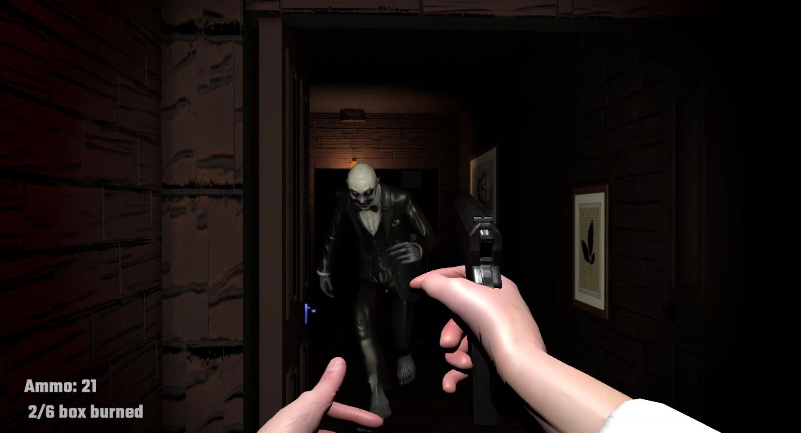
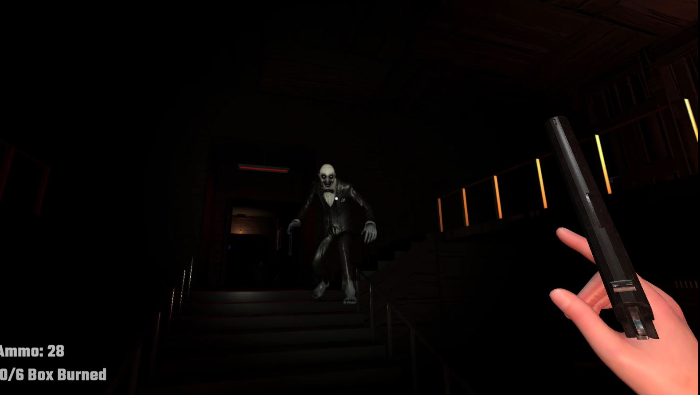
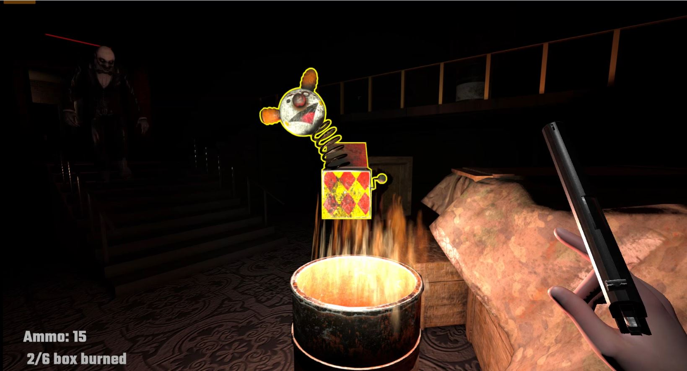
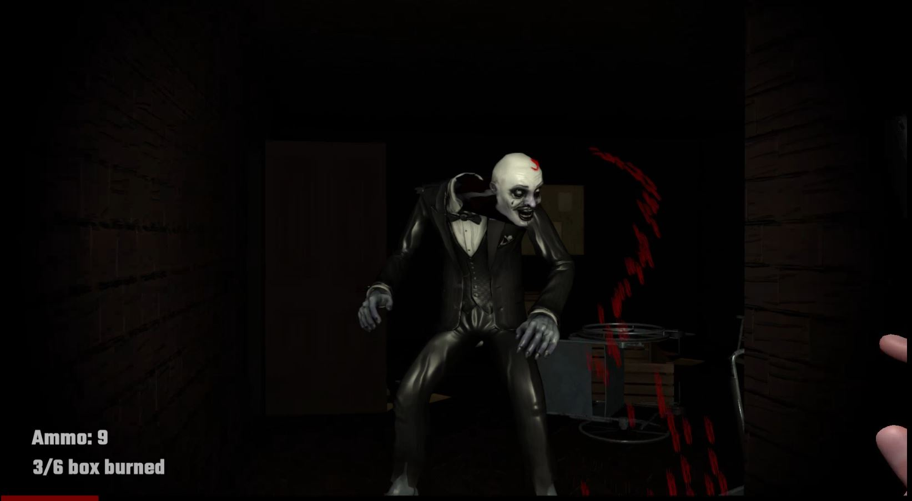
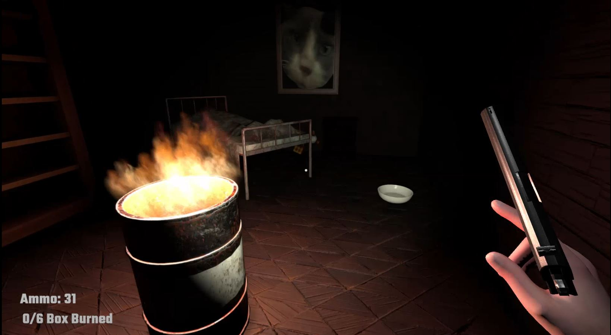
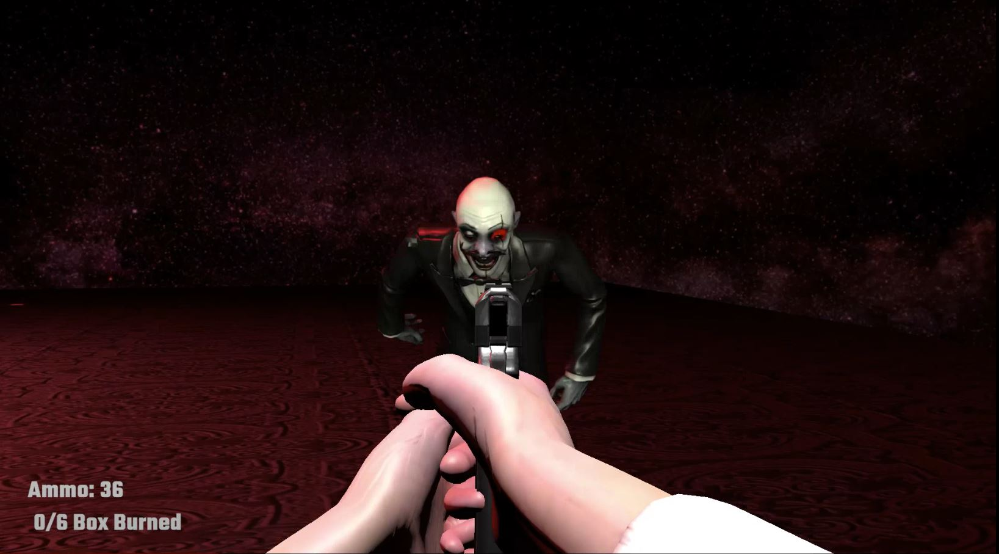

# White Clown Horrr Game - Unity3D
This is a first-person action-horror game with stealth options.
Player must locate and burn six "clown boxes" scattered throughout the house, all while remaining alive and undercover from the "White Clown". 
The house contains different items for player to distract the clown, key items to unlocking the doors, ammos for the handgun and fuels & firelighter to start a fire to use it to burn clown boxes.
Game gets harder to the end of the game. After burning the each clownboxes, an different event like a dream state ("ClownEvent") starts; player teleports to an different area than the house where clown starts to run at her/him, in this event player should kill/stun the clown to end the current event and they teleport back to the house. 

## The Clown
The White Clown has ability to see, hear the player and attack to her/him. It reacts to noises and can open unlocked doors.
It has different states such as
- Wandering
- Seeking the player
- Chasing the player
- Agressive chasing
- Checking noise (going to a point on navmesh)
- Stunned

## Player
- Player can jump, crouch and sprint besides to main first-person movement controls. While crouching, player doesn't create footsteps so it is the best option when the clown is close.
- Player can aim/shoot using the handgun. Shooting the gun without ammo is not possible. Spamming the gun not possible it has a cooldown. Aimless shots are inaccurate.
- Player can collect with keys to unlock doors, ammos, firelighter&fuels to lighten fire barrels.
- Player can grab&throw clownboxes to burn them in fire barrells, fragile and non-fragile items to create sounds and distract the clown.

## In-Game Footage
 
 
 

